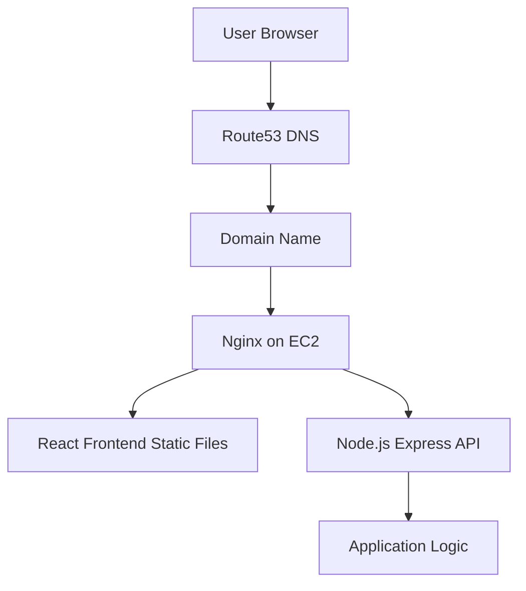

# AWS Node.js + React Deployment Practice Project

## Project Overview

This project demonstrates how to deploy a full-stack web application on AWS using a production-style setup.

The goal of this lab was to simulate a real freelance deployment scenario where a client provides a completed application and needs help deploying it to AWS infrastructure.

The application stack includes:

* **Frontend:** React (Vite)
* **Backend:** Node.js (Express)
* **Process Manager:** PM2
* **Reverse Proxy:** Nginx
* **Infrastructure:** AWS EC2
* **DNS:** AWS Route 53
* **Security:** Let's Encrypt SSL/TLS via Certbot

---

# Architecture

```
Internet
   ↓
DNS Provider (Route53)
   ↓
your-domain.com
   ↓
Nginx Reverse Proxy
   ↓
React Frontend (Static Build)
   ↓
Node.js API running with PM2
```
## Architecture Diagram



---

# Tech Stack

* AWS EC2 (Ubuntu 22.04)
* Node.js
* Express.js
* React (Vite)
* Nginx
* PM2
* Route53 (or any DNS provider)
* Let's Encrypt SSL certificates

---

# Project Structure

```
aws-node-react-deployment/

backend/
   server.js
   package.json

frontend/
   src/
      App.jsx
   package.json

nginx/
   app.conf

scripts/
   backup-sqlite-to-s3.sh

README.md
```

---

# Deployment Guide

## 1. Create Backend API

Create `server.js`

```javascript
const express = require("express");
const app = express();

app.get("/api/health", (req, res) => {
  res.json({ status: "ok", message: "API running" });
});

app.listen(5000, () => {
  console.log("Server running on port 5000");
});
```

Install dependencies

```
npm install express
npm start
```

Test locally

```
http://localhost:5000/api/health
```

---

# 2. Create React Frontend

```
npm create vite@latest frontend -- --template react
cd frontend
npm install
npm run dev
```

Edit:

```
src/App.jsx
```

```javascript
function App() {
  return (
    <div>
      <h1>AWS Deployment Practice Project</h1>
      <p>Frontend is running successfully.</p>
    </div>
  );
}

export default App;
```

---

# 3. Launch AWS EC2 Instance

Configuration used:

* Ubuntu Server 22.04
* Instance type: t2.micro
* Security Group Ports:

```
22   SSH
80   HTTP
443  HTTPS
```

---

# 4. Connect to the Server

```
ssh -i your-key.pem ubuntu@YOUR_EC2_PUBLIC_IP
```

---

# 5. Install Required Software

Update system

```
sudo apt update
```

Install tools

```
sudo apt install nginx git curl -y
```

Install Node.js

```
curl -fsSL https://deb.nodesource.com/setup_20.x | sudo -E bash -
sudo apt install nodejs -y
```

Install PM2

```
sudo npm install -g pm2
```

---

# 6. Clone the Project

```
cd /var/www
git clone https://github.com/YOUR_USERNAME/aws-node-react-deployment.git
```

---

# 7. Run Backend

```
cd backend
npm install
pm2 start server.js
pm2 save
```

Test API

```
curl http://localhost:5000/api/health
```

---

# 8. Build Frontend

```
cd frontend
npm install
npm run build
```

Copy build files

```
sudo cp -r dist/* /var/www/frontend
```

---

# 9. Configure Nginx

Create configuration

```
sudo nano /etc/nginx/sites-available/app
```

Example configuration:

```
server {
    listen 80;

    server_name your-domain.com;

    root /var/www/frontend;

    location / {
        try_files $uri /index.html;
    }

    location /api/ {
        proxy_pass http://127.0.0.1:5000;
    }
}
```

Enable site

```
sudo ln -s /etc/nginx/sites-available/app /etc/nginx/sites-enabled/
sudo nginx -t
sudo systemctl restart nginx
```

---

# 10. Configure Domain

Create an **A Record** in your DNS provider.

Example:

```
app.your-domain.com → YOUR_EC2_PUBLIC_IP
```

---

# 11. Enable HTTPS

Install Certbot

```
sudo apt install certbot python3-certbot-nginx
```

Request certificate

```
sudo certbot --nginx -d app.your-domain.com
```

---

# Troubleshooting

### Node.js Version Error

Issue:

```
Unsupported engine
```

Solution:

Upgrade Node.js to version 20.

---

### SSH Permission Denied

Issue:

```
Permission denied (publickey)
```

Solution:

Ensure the `.pem` key is in the correct directory.

---

### SSL Installation Error

Issue:

```
Could not automatically find a matching server block
```

Solution:

Ensure the Nginx configuration includes the correct domain.

```
server_name app.your-domain.com;
```

---

# Final Result

The application should be accessible via:

```
https://app.your-domain.com
```

---

# Learning Outcomes

This project demonstrates hands-on experience with:

* AWS EC2 server management
* Linux server configuration
* Node.js backend deployment
* React frontend deployment
* Nginx reverse proxy setup
* DNS configuration
* SSL certificate management

---

# Possible Improvements

Future enhancements could include:

* Docker containerization
* CI/CD pipeline (GitHub Actions)
* Infrastructure as Code (Terraform)
* AWS Load Balancer
* Auto deployment scripts
